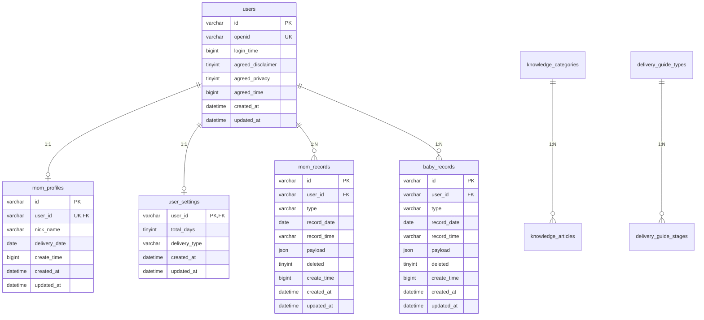

# 沐沐记（tinyDaysMinApp）数据库设计

**文档版本**：v1.0  
**数据库**：MySQL 8.0+  
**字符集**：`utf8mb4`  
**对齐**：`docs/API-后端接口文档.md` 与 `server/` 现有接口字段  
**文档日期**：2026-06-18

---

## 1. 设计原则

| 原则 | 说明 |
|------|------|
| 与 API 字段一一对应 | 接口 JSON 字段名采用 snake_case 存库，读出时转 camelCase |
| 用户数据隔离 | 业务表均通过 `user_id` 关联，查询必须带用户条件 |
| 记录 payload 用 JSON | `mom_records.payload`、`baby_records.payload` 保持与接口一致，便于扩展 |
| 软删除 | 记录表用 `deleted` 标记，档案清除走业务删除而非删用户 |
| 内容可 CMS 化 | 知识库、分娩指南独立内容表，初期可继续读静态文件，后续导入 |

---

## 2. ER 关系图



---

## 3. 表清单

| 表名 | 说明 | 对应 API |
|------|------|----------|
| `users` | 微信用户 | `/auth/*` |
| `mom_profiles` | 妈妈档案 | `/profile/mom`、`/profile/onboarding` |
| `user_settings` | 月子设置 | `/profile/settings` |
| `mom_records` | 妈妈健康记录 | `/records/mom` |
| `baby_records` | 宝宝记录（P2 预留） | `/records/baby` |
| `knowledge_categories` | 知识分类 | `/content/knowledge/categories` |
| `knowledge_articles` | 知识文章 | `/content/knowledge/articles` |
| `delivery_guide_types` | 分娩方式 | `/content/delivery-guide` |
| `delivery_guide_stages` | 阶段指南 | `/content/delivery-guide` |

> 统计类接口（`/stats/mom`、`/home/overview`）不落库，由记录表聚合计算。

---

## 4. 表结构详述

### 4.1 users — 用户表

| 字段 | 类型 | 约束 | API 字段 | 说明 |
|------|------|------|----------|------|
| id | VARCHAR(64) | PK | `user.id` | 如 `user_1718697600000_abc1234` |
| openid | VARCHAR(64) | UNIQUE, NOT NULL | `user.openid` | 微信 openid |
| login_time | BIGINT | NOT NULL | `user.loginTime` | 最近登录毫秒时间戳 |
| agreed_disclaimer | TINYINT(1) | DEFAULT 0 | `user.agreedDisclaimer` | 是否同意免责声明 |
| agreed_privacy | TINYINT(1) | DEFAULT 0 | `user.agreedPrivacy` | 是否同意隐私政策 |
| agreed_time | BIGINT | NULL | `user.agreedTime` | 同意协议时间 |
| created_at | DATETIME(3) | NOT NULL | — | 创建时间 |
| updated_at | DATETIME(3) | NOT NULL | — | 更新时间 |

**索引**

- `uk_openid` (`openid`)

---

### 4.2 mom_profiles — 妈妈档案表

与 `users` 一对一。`onboarded` 由 `delivery_date IS NOT NULL` 推导，不单独存字段。

| 字段 | 类型 | 约束 | API 字段 | 说明 |
|------|------|------|----------|------|
| id | VARCHAR(64) | PK | `mom.id` | 档案 ID |
| user_id | VARCHAR(64) | UNIQUE, FK → users.id | — | 所属用户 |
| nick_name | VARCHAR(50) | NOT NULL | `mom.nickName` | 称呼 |
| delivery_date | DATE | NULL | `mom.deliveryDate` | 生产日期 YYYY-MM-DD |
| create_time | BIGINT | NOT NULL | `mom.createTime` | 档案创建毫秒时间戳 |
| created_at | DATETIME(3) | NOT NULL | — | |
| updated_at | DATETIME(3) | NOT NULL | — | |

**索引**

- `uk_user_id` (`user_id`)
- `idx_delivery_date` (`delivery_date`)

---

### 4.3 user_settings — 用户月子设置表

与 `users` 一对一。

| 字段 | 类型 | 约束 | API 字段 | 说明 |
|------|------|------|----------|------|
| user_id | VARCHAR(64) | PK, FK → users.id | — | 所属用户 |
| total_days | TINYINT | NOT NULL, DEFAULT 42 | `settings.totalDays` | 28 / 30 / 42 |
| delivery_type | VARCHAR(20) | NOT NULL, DEFAULT 'natural' | `settings.deliveryType` | `natural` / `cesarean` |
| created_at | DATETIME(3) | NOT NULL | — | |
| updated_at | DATETIME(3) | NOT NULL | — | |

**检查约束（应用层或 DB）**

- `total_days IN (28, 30, 42)`
- `delivery_type IN ('natural', 'cesarean')`

---

### 4.4 mom_records — 妈妈健康记录表

| 字段 | 类型 | 约束 | API 字段 | 说明 |
|------|------|------|----------|------|
| id | VARCHAR(64) | PK | `id` | 记录 ID |
| user_id | VARCHAR(64) | FK → users.id, NOT NULL | — | 所属用户 |
| type | VARCHAR(20) | NOT NULL | `type` | 见下方枚举 |
| record_date | DATE | NOT NULL | `date` | 记录日期 |
| record_time | VARCHAR(5) | NOT NULL | `time` | HH:mm |
| payload | JSON | NOT NULL | `payload` | 类型相关字段 |
| deleted | TINYINT(1) | DEFAULT 0 | `deleted` | 软删除 |
| create_time | BIGINT | NOT NULL | `createTime` | 创建毫秒时间戳 |
| created_at | DATETIME(3) | NOT NULL | — | |
| updated_at | DATETIME(3) | NOT NULL | — | |

**type 枚举**

`lochia` | `pain` | `mood` | `weight` | `breast`

**payload JSON 结构**

```json
// lochia
{ "color": "red|pink|brown|yellow", "amount": "light|medium|heavy", "note": "" }

// pain
{ "score": 1-10, "note": "" }

// mood
{ "level": 1-5 }

// weight
{ "kg": 58.5, "note": "" }

// breast
{ "engorgement": "none|mild|moderate|severe", "blocked": "no|yes", "side": "left|right|both", "feeding": "good|fair|hard", "note": "" }
```

**索引**

- `idx_user_date` (`user_id`, `record_date`, `deleted`)
- `idx_user_type` (`user_id`, `type`, `deleted`)
- `idx_user_create` (`user_id`, `create_time`)

---

### 4.5 baby_records — 宝宝记录表（P2 预留）

结构与 `mom_records` 相同，`type` 枚举不同。

**type 枚举**

`feed` | `sleep` | `diaper`

**payload JSON 结构**

```json
// feed
{ "feedType": "breast|formula|mixed", "side": "left|right|both", "duration": 15, "amount": null }

// sleep
{ "duration": 60, "status": "start|end" }

// diaper
{ "diaperType": "pee|poop|both" }
```

---

### 4.6 knowledge_categories — 知识分类表

| 字段 | 类型 | 约束 | API 字段 | 说明 |
|------|------|------|----------|------|
| id | VARCHAR(32) | PK | `id` | 如 `recovery`（`all` 为虚拟分类，不入库） |
| label | VARCHAR(50) | NOT NULL | `label` | 显示名 |
| sort_order | INT | DEFAULT 0 | — | 排序 |
| created_at | DATETIME(3) | NOT NULL | — | |

---

### 4.7 knowledge_articles — 知识文章表

| 字段 | 类型 | 约束 | API 字段 | 说明 |
|------|------|------|----------|------|
| id | VARCHAR(64) | PK | `id` | 如 `lochia-guide` |
| category_id | VARCHAR(32) | FK → knowledge_categories.id | `category` | 分类 |
| icon | VARCHAR(10) | NOT NULL | `icon` | emoji |
| title | VARCHAR(100) | NOT NULL | `title` | 标题 |
| summary | VARCHAR(500) | NOT NULL | `summary` | 摘要 |
| read_minutes | TINYINT | DEFAULT 3 | `readMinutes` | 阅读时长 |
| day_range_min | TINYINT | NOT NULL | `dayRange[0]` | 推荐月子天数下限 |
| day_range_max | TINYINT | NOT NULL | `dayRange[1]` | 推荐月子天数上限 |
| paragraphs | JSON | NOT NULL | `paragraphs` | 段落数组 |
| status | TINYINT | DEFAULT 1 | — | 1 发布 0 下架 |
| sort_order | INT | DEFAULT 0 | — | 排序 |
| created_at | DATETIME(3) | NOT NULL | — | |
| updated_at | DATETIME(3) | NOT NULL | — | |

**索引**

- `idx_category` (`category_id`, `status`)
- `idx_day_range` (`day_range_min`, `day_range_max`)

---

### 4.8 delivery_guide_types — 分娩方式表

| 字段 | 类型 | 约束 | API 字段 | 说明 |
|------|------|------|----------|------|
| id | VARCHAR(20) | PK | — | `natural` / `cesarean` |
| label | VARCHAR(20) | NOT NULL | `deliveryLabel` | 顺产 / 剖腹产 |

---

### 4.9 delivery_guide_stages — 分娩阶段指南表

| 字段 | 类型 | 约束 | API 字段 | 说明 |
|------|------|------|----------|------|
| id | BIGINT | PK, AUTO_INCREMENT | — | 自增主键 |
| delivery_type_id | VARCHAR(20) | FK → delivery_guide_types.id | `deliveryType` | 分娩方式 |
| stage_index | TINYINT | NOT NULL | `index` | 阶段序号 0-based |
| day_from | TINYINT | NOT NULL | `from` | 天数起 |
| day_to | TINYINT | NOT NULL | `to` | 天数止 |
| focus | VARCHAR(200) | NOT NULL | `focus` | 阶段重点 |
| care | JSON | NOT NULL | `care` | 护理要点数组 |
| avoid | JSON | NOT NULL | `avoid` | 避免事项数组 |
| watch | JSON | NOT NULL | `watch` | 警惕信号数组 |
| created_at | DATETIME(3) | NOT NULL | — | |

**索引**

- `uk_type_stage` (`delivery_type_id`, `stage_index`)
- `idx_day_range` (`delivery_type_id`, `day_from`, `day_to`)

---

## 5. 字段映射（API ↔ 数据库）

| API (camelCase) | DB (snake_case) |
|-----------------|-----------------|
| nickName | nick_name |
| deliveryDate | delivery_date |
| createTime | create_time |
| totalDays | total_days |
| deliveryType | delivery_type |
| agreedDisclaimer | agreed_disclaimer |
| agreedPrivacy | agreed_privacy |
| agreedTime | agreed_time |
| date (记录) | record_date |
| time (记录) | record_time |
| readMinutes | read_minutes |
| dayRange | day_range_min / day_range_max |

---

## 6. 常用查询示例

### 6.1 获取用户档案状态（`/profile/status`）

```sql
SELECT
  u.id AS user_id,
  m.id, m.nick_name, m.delivery_date, m.create_time,
  s.total_days, s.delivery_type,
  (m.delivery_date IS NOT NULL) AS onboarded
FROM users u
LEFT JOIN mom_profiles m ON m.user_id = u.id
LEFT JOIN user_settings s ON s.user_id = u.id
WHERE u.id = ?;
```

### 6.2 今日妈妈记录（`/records/mom/today`）

```sql
SELECT id, type, record_date, record_time, payload, deleted, create_time
FROM mom_records
WHERE user_id = ? AND record_date = CURDATE() AND deleted = 0
ORDER BY record_time DESC;
```

### 6.3 妈妈趋势统计（`/stats/mom`）

按 `record_date` 分组，在应用层用 `aggregateMomDay` 逻辑聚合；或按日期范围：

```sql
SELECT id, type, record_date, record_time, payload
FROM mom_records
WHERE user_id = ? AND deleted = 0
  AND record_date BETWEEN ? AND ?
ORDER BY record_date ASC, record_time ASC;
```

### 6.4 清除用户数据（`/profile/data`）

```sql
DELETE FROM mom_records WHERE user_id = ?;
DELETE FROM baby_records WHERE user_id = ?;
DELETE FROM mom_profiles WHERE user_id = ?;
UPDATE user_settings SET total_days = 42, delivery_type = 'natural' WHERE user_id = ?;
UPDATE users SET agreed_disclaimer = 0, agreed_privacy = 0, agreed_time = NULL WHERE id = ?;
```

---

## 7. 实施建议

| 阶段 | 内容 |
|------|------|
| 第一步 | 建库执行 `server/sql/schema.sql` |
| 第二步 | 用 `mysql2` 或 Prisma 替换 `server/src/store` JSON 文件存储 |
| 第三步 | 将 `server/src/content/*.js` 静态数据导入 `knowledge_*`、`delivery_guide_*` 表 |
| 第四步 | 生产环境配置连接池、备份策略 |

**连接配置示例（`.env`）**

```
DB_HOST=127.0.0.1
DB_PORT=3306
DB_USER=tinydays
DB_PASSWORD=your_password
DB_NAME=tinydays
```

---

## 8. 后续扩展（P3）

以下表本期不建，家庭共享、提醒推送时再补充：

- `families` — 家庭组
- `family_members` — 成员与角色（妈妈/伴侣/长辈）
- `reminders` — 提醒规则
- `reminder_logs` — 提醒发送记录
